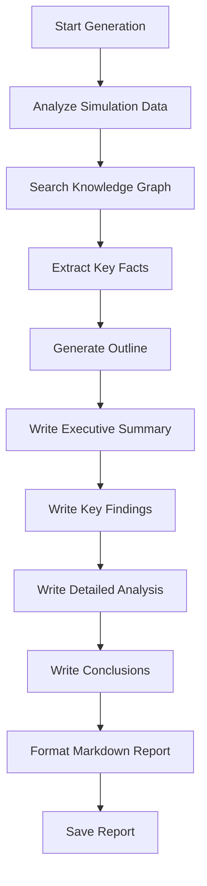

## Generate Report

<Note>
  Generate a comprehensive analytical report from simulation results. This is an asynchronous operation that uses AI to analyze agent behaviors, sentiment trends, and key insights.
</Note>

```bash
POST /api/report/generate
```

### Request Body (JSON)

<ParamField body="simulation_id" type="string" required>
  Simulation identifier
</ParamField>

<ParamField body="force_regenerate" type="boolean" default="false">
  Force regeneration even if a report already exists
</ParamField>

### Response

<ResponseField name="success" type="boolean">
  Whether the request succeeded
</ResponseField>

<ResponseField name="data" type="object">
  <Expandable title="Report generation task">
    <ResponseField name="simulation_id" type="string">
      Simulation identifier
    </ResponseField>
    <ResponseField name="report_id" type="string">
      Generated report identifier
    </ResponseField>
    <ResponseField name="task_id" type="string">
      Task ID for progress tracking
    </ResponseField>
    <ResponseField name="status" type="string">
      Generation status: `generating` or `completed` (if already exists)
    </ResponseField>
    <ResponseField name="message" type="string">
      Status message
    </ResponseField>
    <ResponseField name="already_generated" type="boolean">
      Whether report already existed
    </ResponseField>
  </Expandable>
</ResponseField>

### Example

<CodeGroup>
```bash cURL
curl -X POST http://localhost:5001/api/report/generate \
  -H "Content-Type: application/json" \
  -d '{
    "simulation_id": "sim_xyz789",
    "force_regenerate": false
  }'
```

```javascript JavaScript
const response = await fetch(
  'http://localhost:5001/api/report/generate',
  {
    method: 'POST',
    headers: { 'Content-Type': 'application/json' },
    body: JSON.stringify({
      simulation_id: 'sim_xyz789',
      force_regenerate: false
    })
  }
);
const data = await response.json();
```

```python Python
import requests

response = requests.post(
    'http://localhost:5001/api/report/generate',
    json={
        'simulation_id': 'sim_xyz789',
        'force_regenerate': False
    }
)
data = response.json()
```
</CodeGroup>

### Response Example

```json
{
  "success": true,
  "data": {
    "simulation_id": "sim_xyz789",
    "report_id": "report_abc123",
    "task_id": "task_report456",
    "status": "generating",
    "message": "报告生成任务已启动，请通过 /api/report/generate/status 查询进度",
    "already_generated": false
  }
}
```

## Report Generation Process

The AI Report Agent follows this workflow:



### Generation Stages

1. **Planning** (0-10%): Analyze simulation scope and create report outline
2. **Data Collection** (10-30%): Search knowledge graph and simulation logs
3. **Analysis** (30-70%): Process agent behaviors, sentiment, and interactions
4. **Writing** (70-90%): Generate report sections with insights
5. **Finalization** (90-100%): Format and save complete report

## Report Structure

Generated reports include:

### Executive Summary

- High-level overview
- Key findings at a glance
- Critical insights

### Simulation Background

- Simulation parameters
- Agent demographics
- Platform coverage

### Key Findings

- Primary sentiment trends
- Agent behavior patterns
- Influential agents and topics

### Detailed Analysis

- Temporal sentiment evolution
- Topic-wise breakdown
- Agent type comparisons
- Platform-specific insights

### Supporting Evidence

- Example posts and comments
- Agent quotes
- Statistical summaries

### Conclusions & Recommendations

- Strategic insights
- Actionable recommendations
- Risk assessment

## Force Regeneration

To regenerate an existing report:

```bash
curl -X POST http://localhost:5001/api/report/generate \
  -H "Content-Type: application/json" \
  -d '{
    "simulation_id": "sim_xyz789",
    "force_regenerate": true
  }'
```

<Warning>
  Force regeneration will overwrite the existing report. This is useful if simulation data has been updated or you want fresh analysis.
</Warning>

## Error Responses

<CodeGroup>
```json Missing Simulation ID
{
  "success": false,
  "error": "请提供 simulation_id"
}
```

```json Simulation Not Found
{
  "success": false,
  "error": "模拟不存在: sim_invalid"
}
```

```json Missing Graph
{
  "success": false,
  "error": "缺少图谱ID，请确保已构建图谱"
}
```

```json Missing Requirement
{
  "success": false,
  "error": "缺少模拟需求描述"
}
```

```json Generation Failed
{
  "success": false,
  "error": "Report generation failed: LLM API timeout",
  "traceback": "..."
}
```
</CodeGroup>

## Already Generated Response

If a report already exists:

```json
{
  "success": true,
  "data": {
    "simulation_id": "sim_xyz789",
    "report_id": "report_abc123",
    "status": "completed",
    "message": "报告已存在",
    "already_generated": true
  }
}
```

Use the `report_id` to retrieve the existing report via `/api/report/{report_id}`.

## Report Agent Tools

The Report Agent uses specialized tools:

### Graph Search

Search knowledge graph for relevant facts:

```json
{
  "tool": "search_graph",
  "query": "student opinions about attendance policy",
  "limit": 20
}
```

### Insight Forge

Analyze simulation logs for patterns:

```json
{
  "tool": "insight_forge",
  "analysis_type": "sentiment_trends",
  "time_range": "all"
}
```

### Agent Profiler

Get agent demographic breakdowns:

```json
{
  "tool": "agent_profiler",
  "grouping": "entity_type"
}
```

## Performance Considerations

<Note>
  Report generation typically takes 3-10 minutes depending on simulation size and complexity.
</Note>

### Factors Affecting Speed

- **Simulation size:** More agents = longer analysis
- **Activity volume:** More posts/comments = more data to process
- **LLM provider:** Different providers have different latencies
- **Graph size:** Larger knowledge graphs take longer to search

### Optimization

- Reports are generated once and cached
- Incremental section generation allows partial viewing
- Progress tracking shows real-time status

## Monitoring Progress

Poll the status endpoint to track progress:

```javascript
async function pollReportStatus(taskId) {
  while (true) {
    const response = await fetch(
      'http://localhost:5001/api/report/generate/status',
      {
        method: 'POST',
        headers: { 'Content-Type': 'application/json' },
        body: JSON.stringify({ task_id: taskId })
      }
    );
    const data = await response.json();
    
    console.log(`Progress: ${data.data.progress}% - ${data.data.message}`);
    
    if (data.data.status === 'completed') {
      console.log('Report complete!');
      return data.data.result.report_id;
    }
    
    if (data.data.status === 'failed') {
      throw new Error('Report generation failed');
    }
    
    await new Promise(resolve => setTimeout(resolve, 3000)); // Wait 3 seconds
  }
}

const reportId = await pollReportStatus('task_report456');
```

## Real-time Section Access

<Note>
  You can access completed report sections before the entire report is finished using the `/api/report/{report_id}/sections` endpoint.
</Note>

This enables:
- Progressive loading in UI
- Early access to executive summary
- Reduced wait time for users

## Report Formats

### Markdown (Default)

Reports are generated in Markdown format:

```markdown
# University Policy Simulation Report

## Executive Summary

The simulation revealed strong negative sentiment among students...

## Key Findings

1. **Sentiment Analysis**: 68% of students expressed concerns
2. **Top Topics**: Academic freedom, research flexibility
3. **Influential Voices**: Senior students and club leaders
```

### Download Options

Download as Markdown file:

```bash
curl -O http://localhost:5001/api/report/report_abc123/download
```

## Best Practices

### When to Generate

<Warning>
  Generate reports only after simulation completion for accurate analysis.
</Warning>

- **After completion:** Full data available, best insights
- **During simulation:** Incomplete data, may miss trends
- **Never before simulation:** No data to analyze

### Report Reuse

```javascript
// Check if report exists first
const checkResponse = await fetch(
  `http://localhost:5001/api/report/by-simulation/sim_xyz789`
);

if (checkResponse.ok) {
  // Report exists, use it
  const report = await checkResponse.json();
  console.log('Using existing report:', report.data.report_id);
} else {
  // Generate new report
  const generateResponse = await fetch(
    'http://localhost:5001/api/report/generate',
    {
      method: 'POST',
      headers: { 'Content-Type': 'application/json' },
      body: JSON.stringify({ simulation_id: 'sim_xyz789' })
    }
  );
}
```

## Next Steps

<CardGroup cols={2}>
  <Card title="Check Report Status" icon="chart-line" href="/api/report/status">
    Monitor report generation progress
  </Card>
  <Card title="Chat with Report Agent" icon="comment-dots" href="/api/report/chat">
    Ask questions about your report
  </Card>
</CardGroup>