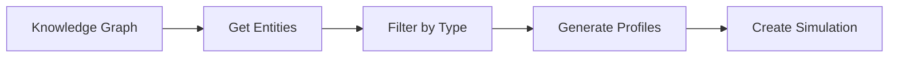

## Get Graph Entities

<Note>
  Retrieve all entities from a knowledge graph, filtered by defined entity types. These entities will be used to generate agent profiles.
</Note>

```bash
GET /api/simulation/entities/{graph_id}
```

### Path Parameters

<ParamField path="graph_id" type="string" required>
  Knowledge graph identifier (e.g., `mirofish_abc123`)
</ParamField>

### Query Parameters

<ParamField query="entity_types" type="string">
  Comma-separated list of entity types to filter (e.g., `Student,Professor`). If not provided, returns all defined entity types.
</ParamField>

<ParamField query="enrich" type="boolean" default="true">
  Whether to include relationship (edge) information for each entity
</ParamField>

### Response

<ResponseField name="success" type="boolean">
  Whether the request succeeded
</ResponseField>

<ResponseField name="data" type="object">
  <Expandable title="Entity filter result">
    <ResponseField name="graph_id" type="string">
      Graph identifier
    </ResponseField>
    <ResponseField name="filtered_count" type="number">
      Number of entities matching the filter
    </ResponseField>
    <ResponseField name="total_count" type="number">
      Total entities in the graph
    </ResponseField>
    <ResponseField name="entity_types" type="array">
      List of entity types found
    </ResponseField>
    <ResponseField name="entities" type="array">
      Array of entity objects with uuid, name, labels, facts, and edges
    </ResponseField>
  </Expandable>
</ResponseField>

### Example

<CodeGroup>
```bash cURL - All Entities
curl "http://localhost:5001/api/simulation/entities/mirofish_abc123?enrich=true"
```

```bash cURL - Filtered
curl "http://localhost:5001/api/simulation/entities/mirofish_abc123?entity_types=Student,Professor&enrich=true"
```

```javascript JavaScript
const graphId = 'mirofish_abc123';
const entityTypes = ['Student', 'Professor'].join(',');

const response = await fetch(
  `http://localhost:5001/api/simulation/entities/${graphId}?entity_types=${entityTypes}&enrich=true`
);
const data = await response.json();
```

```python Python
import requests

graph_id = 'mirofish_abc123'
entity_types = 'Student,Professor'

response = requests.get(
    f'http://localhost:5001/api/simulation/entities/{graph_id}',
    params={
        'entity_types': entity_types,
        'enrich': 'true'
    }
)
data = response.json()
```
</CodeGroup>

### Response Example

```json
{
  "success": true,
  "data": {
    "graph_id": "mirofish_abc123",
    "filtered_count": 45,
    "total_count": 128,
    "entity_types": ["Student", "Professor"],
    "entities": [
      {
        "uuid": "ent_1a2b3c4d",
        "name": "Alex Chen",
        "labels": ["Entity", "Student"],
        "facts": [
          "Senior computer science major",
          "Member of robotics club",
          "GPA: 3.8"
        ],
        "edges": [
          {
            "fact": "Studies with Professor Smith",
            "edge_type": "STUDIES_WITH",
            "target_uuid": "ent_5e6f7g8h",
            "target_name": "Professor Smith"
          }
        ]
      },
      {
        "uuid": "ent_9i0j1k2l",
        "name": "Maria Rodriguez",
        "labels": ["Entity", "Student"],
        "facts": [
          "Freshman biology major",
          "President of environmental club",
          "Scholarship recipient"
        ],
        "edges": []
      }
    ]
  }
}
```

## Get Entity Detail

Retrieve detailed information about a specific entity.

```bash
GET /api/simulation/entities/{graph_id}/{entity_uuid}
```

### Path Parameters

<ParamField path="graph_id" type="string" required>
  Knowledge graph identifier
</ParamField>

<ParamField path="entity_uuid" type="string" required>
  Unique entity identifier
</ParamField>

### Response

<ResponseField name="success" type="boolean">
  Whether the request succeeded
</ResponseField>

<ResponseField name="data" type="object">
  <Expandable title="Entity details">
    <ResponseField name="uuid" type="string">
      Entity unique identifier
    </ResponseField>
    <ResponseField name="name" type="string">
      Entity name
    </ResponseField>
    <ResponseField name="labels" type="array">
      Entity type labels
    </ResponseField>
    <ResponseField name="facts" type="array">
      Array of facts about the entity
    </ResponseField>
    <ResponseField name="edges" type="array">
      Relationships to other entities
    </ResponseField>
  </Expandable>
</ResponseField>

### Example

```bash
curl http://localhost:5001/api/simulation/entities/mirofish_abc123/ent_1a2b3c4d
```

### Response Example

```json
{
  "success": true,
  "data": {
    "uuid": "ent_1a2b3c4d",
    "name": "Alex Chen",
    "labels": ["Entity", "Student"],
    "facts": [
      "Senior computer science major at State University",
      "Active member of robotics club since sophomore year",
      "Maintains 3.8 GPA",
      "Works part-time as teaching assistant",
      "Plans to pursue graduate studies in AI"
    ],
    "edges": [
      {
        "fact": "Studies advanced algorithms with Professor Smith",
        "edge_type": "STUDIES_WITH",
        "target_uuid": "ent_5e6f7g8h",
        "target_name": "Professor Smith"
      },
      {
        "fact": "Co-leads robotics project with Sarah Johnson",
        "edge_type": "COLLABORATES_WITH",
        "target_uuid": "ent_3m4n5o6p",
        "target_name": "Sarah Johnson"
      }
    ]
  }
}
```

## Get Entities By Type

Retrieve all entities of a specific type.

```bash
GET /api/simulation/entities/{graph_id}/by-type/{entity_type}
```

### Path Parameters

<ParamField path="graph_id" type="string" required>
  Knowledge graph identifier
</ParamField>

<ParamField path="entity_type" type="string" required>
  Entity type name (e.g., `Student`, `Professor`)
</ParamField>

### Query Parameters

<ParamField query="enrich" type="boolean" default="true">
  Include edge information
</ParamField>

### Response

<ResponseField name="success" type="boolean">
  Whether the request succeeded
</ResponseField>

<ResponseField name="data" type="object">
  <Expandable title="Entities by type">
    <ResponseField name="entity_type" type="string">
      The requested entity type
    </ResponseField>
    <ResponseField name="count" type="number">
      Number of entities found
    </ResponseField>
    <ResponseField name="entities" type="array">
      Array of entity objects
    </ResponseField>
  </Expandable>
</ResponseField>

### Example

```bash
curl "http://localhost:5001/api/simulation/entities/mirofish_abc123/by-type/Student?enrich=true"
```

### Response Example

```json
{
  "success": true,
  "data": {
    "entity_type": "Student",
    "count": 32,
    "entities": [
      {
        "uuid": "ent_1a2b3c4d",
        "name": "Alex Chen",
        "labels": ["Entity", "Student"],
        "facts": ["Senior computer science major"],
        "edges": [...]
      },
      // ... more students
    ]
  }
}
```

## Entity Object Structure

### Entity Fields

<ResponseField name="uuid" type="string">
  Unique identifier assigned by the knowledge graph system
</ResponseField>

<ResponseField name="name" type="string">
  Human-readable entity name
</ResponseField>

<ResponseField name="labels" type="array">
  Type labels, always includes `"Entity"` plus specific types (e.g., `["Entity", "Student"]`)
</ResponseField>

<ResponseField name="facts" type="array">
  Array of text facts describing the entity, extracted from source documents
</ResponseField>

<ResponseField name="edges" type="array" optional>
  <Expandable title="Relationship edges (when enrich=true)">
    <ResponseField name="fact" type="string">
      Descriptive text of the relationship
    </ResponseField>
    <ResponseField name="edge_type" type="string">
      Relationship type (from ontology)
    </ResponseField>
    <ResponseField name="target_uuid" type="string">
      UUID of the related entity
    </ResponseField>
    <ResponseField name="target_name" type="string">
      Name of the related entity
    </ResponseField>
  </Expandable>
</ResponseField>

## Use Cases

### Agent Profile Generation

Entities are used to generate realistic agent profiles:



### Entity Filtering Strategy

<Note>
  **Best Practice:** Filter entities to only include types relevant to your simulation scenario.
</Note>

For example, in a university policy simulation:
- **Include:** `Student`, `Professor`, `Administrator`
- **Exclude:** `Building`, `Course`, `Policy` (these are context, not agents)

## Error Responses

<CodeGroup>
```json Configuration Error
{
  "success": false,
  "error": "ZEP_API_KEY未配置"
}
```

```json Entity Not Found
{
  "success": false,
  "error": "实体不存在: ent_invalid"
}
```

```json Graph Access Error
{
  "success": false,
  "error": "Failed to access graph: Connection timeout",
  "traceback": "..."
}
```
</CodeGroup>

## Performance Considerations

### Enrichment Trade-off

<ParamField query="enrich" type="boolean">
  - **`enrich=true`** (default): Includes relationship data, slower for large graphs (100+ entities)
  - **`enrich=false`**: Faster, returns only entity data without relationships
</ParamField>

For large graphs (> 200 entities), consider:
1. Use `enrich=false` for initial count
2. Filter by specific entity types
3. Use `enrich=true` only for final profile generation

## Next Steps

<CardGroup cols={2}>
  <Card title="Generate Profiles" icon="user-circle" href="/api/simulation/profiles">
    Create agent profiles from entities
  </Card>
  <Card title="Create Simulation" icon="play" href="/api/simulation/run">
    Set up and run simulations
  </Card>
</CardGroup>