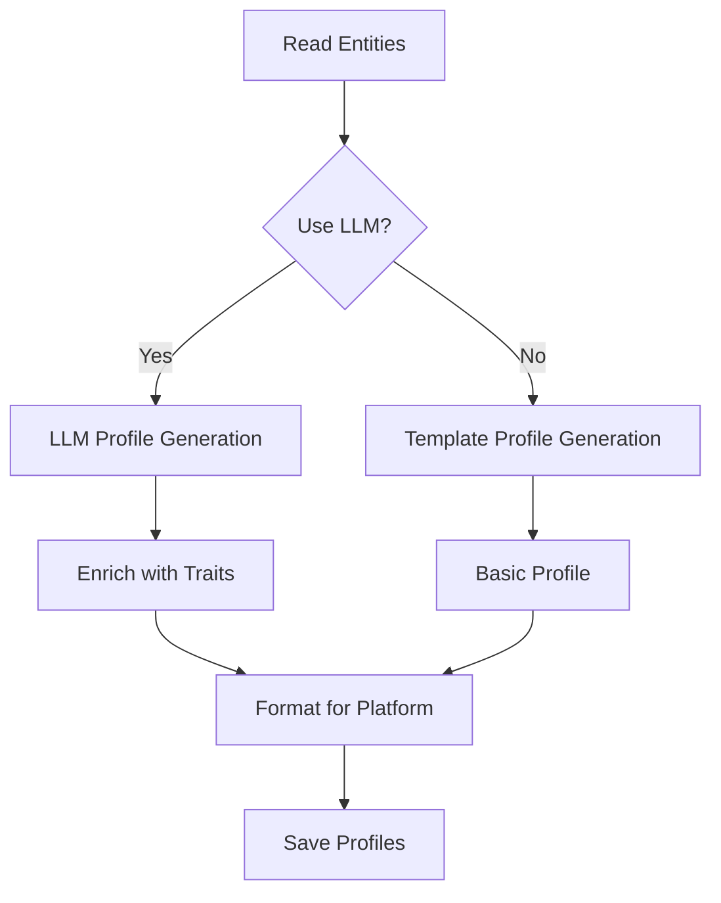

## Generate Profiles

<Note>
  Generate OASIS agent profiles from knowledge graph entities. This is typically called as part of simulation preparation.
</Note>

```bash
POST /api/simulation/profiles/generate
```

### Request Body (JSON)

<ParamField body="graph_id" type="string" required>
  Knowledge graph identifier
</ParamField>

<ParamField body="entity_types" type="array">
  Array of entity type names to include (e.g., `["Student", "Professor"]`). If omitted, uses all defined entity types.
</ParamField>

<ParamField body="use_llm" type="boolean" default="true">
  Whether to use LLM to enhance profile generation with personality traits and behavioral patterns
</ParamField>

<ParamField body="platform" type="string" default="reddit">
  Target platform: `reddit` or `twitter`
</ParamField>

### Response

<ResponseField name="success" type="boolean">
  Whether the request succeeded
</ResponseField>

<ResponseField name="data" type="object">
  <Expandable title="Profile generation result">
    <ResponseField name="platform" type="string">
      Target platform (reddit or twitter)
    </ResponseField>
    <ResponseField name="entity_types" type="array">
      Entity types included
    </ResponseField>
    <ResponseField name="count" type="number">
      Number of profiles generated
    </ResponseField>
    <ResponseField name="profiles" type="array">
      Array of agent profile objects (format depends on platform)
    </ResponseField>
  </Expandable>
</ResponseField>

### Example

<CodeGroup>
```bash cURL
curl -X POST http://localhost:5001/api/simulation/profiles/generate \
  -H "Content-Type: application/json" \
  -d '{
    "graph_id": "mirofish_abc123",
    "entity_types": ["Student", "Professor"],
    "use_llm": true,
    "platform": "reddit"
  }'
```

```javascript JavaScript
const response = await fetch(
  'http://localhost:5001/api/simulation/profiles/generate',
  {
    method: 'POST',
    headers: { 'Content-Type': 'application/json' },
    body: JSON.stringify({
      graph_id: 'mirofish_abc123',
      entity_types: ['Student', 'Professor'],
      use_llm: true,
      platform: 'reddit'
    })
  }
);
const data = await response.json();
```

```python Python
import requests

response = requests.post(
    'http://localhost:5001/api/simulation/profiles/generate',
    json={
        'graph_id': 'mirofish_abc123',
        'entity_types': ['Student', 'Professor'],
        'use_llm': True,
        'platform': 'reddit'
    }
)
data = response.json()
```
</CodeGroup>

### Response Example (Reddit Format)

```json
{
  "success": true,
  "data": {
    "platform": "reddit",
    "entity_types": ["Student", "Professor"],
    "count": 45,
    "profiles": [
      {
        "username": "alex_chen_cs",
        "bio": "CS senior passionate about AI and robotics. Member of university robotics club.",
        "traits": "analytical, curious, collaborative",
        "interests": ["artificial intelligence", "robotics", "algorithms", "gaming"],
        "post_frequency": "high",
        "karma": 2847,
        "account_age_days": 1095,
        "entity_uuid": "ent_1a2b3c4d",
        "entity_name": "Alex Chen",
        "entity_facts": [
          "Senior computer science major",
          "Member of robotics club",
          "GPA: 3.8"
        ]
      },
      {
        "username": "maria_bio_student",
        "bio": "Freshman biology major and environmental club president. Love nature and sustainability.",
        "traits": "passionate, activist, empathetic",
        "interests": ["environmental science", "conservation", "hiking", "photography"],
        "post_frequency": "medium",
        "karma": 532,
        "account_age_days": 90,
        "entity_uuid": "ent_9i0j1k2l",
        "entity_name": "Maria Rodriguez",
        "entity_facts": [
          "Freshman biology major",
          "President of environmental club"
        ]
      }
    ]
  }
}
```

## Profile Formats

### Reddit Profile

Reddit agent profiles include:

<ResponseField name="username" type="string">
  Reddit username (generated from entity name)
</ResponseField>

<ResponseField name="bio" type="string">
  Short biographical description
</ResponseField>

<ResponseField name="traits" type="string">
  Personality traits (comma-separated)
</ResponseField>

<ResponseField name="interests" type="array">
  Topics of interest
</ResponseField>

<ResponseField name="post_frequency" type="string">
  Activity level: `low`, `medium`, `high`
</ResponseField>

<ResponseField name="karma" type="number">
  Simulated Reddit karma score
</ResponseField>

<ResponseField name="account_age_days" type="number">
  Simulated account age in days
</ResponseField>

<ResponseField name="entity_uuid" type="string">
  Source entity identifier
</ResponseField>

<ResponseField name="entity_name" type="string">
  Original entity name from knowledge graph
</ResponseField>

<ResponseField name="entity_facts" type="array">
  Facts about the entity from knowledge graph
</ResponseField>

### Twitter Profile

Twitter profiles include similar fields adapted for Twitter:

```json
{
  "handle": "@alex_chen_tech",
  "display_name": "Alex Chen",
  "bio": "CS senior | AI enthusiast | Robotics club member",
  "followers": 342,
  "following": 189,
  "tweet_frequency": "high",
  "verified": false,
  "entity_uuid": "ent_1a2b3c4d"
}
```

## LLM Enhancement

### With LLM (`use_llm: true`)

When enabled, LLM generates:
- Rich personality traits
- Realistic behavioral patterns
- Context-aware interests
- Natural language bios

<Note>
  **Recommended for realistic simulations.** LLM enhancement creates more nuanced agent behaviors.
</Note>

### Without LLM (`use_llm: false`)

Faster generation using templates:
- Basic profile structure
- Direct fact mapping
- Generic traits

<Warning>
  Without LLM, profiles may be less diverse and realistic. Use only when speed is critical.
</Warning>

## Profile Generation Process



## Integration with Simulation Preparation

<Note>
  Profile generation is automatically handled by `/api/simulation/prepare`. You typically don't need to call this endpoint directly.
</Note>

The `/prepare` endpoint:
1. Reads entities from graph
2. Generates profiles (this endpoint's logic)
3. Creates simulation configuration
4. Prepares platform-specific files

## Get Simulation Profiles

Retrieve generated profiles for an existing simulation:

```bash
GET /api/simulation/{simulation_id}/profiles
```

### Query Parameters

<ParamField query="platform" type="string" default="reddit">
  Platform: `reddit` or `twitter`
</ParamField>

### Example

```bash
curl "http://localhost:5001/api/simulation/sim_xyz789/profiles?platform=reddit"
```

### Response Example

```json
{
  "success": true,
  "data": {
    "platform": "reddit",
    "count": 45,
    "profiles": [
      // Array of profile objects
    ]
  }
}
```

## Real-time Profile Monitoring

Monitor profile generation progress during preparation:

```bash
GET /api/simulation/{simulation_id}/profiles/realtime
```

### Response Example

```json
{
  "success": true,
  "data": {
    "simulation_id": "sim_xyz789",
    "platform": "reddit",
    "count": 15,
    "total_expected": 45,
    "is_generating": true,
    "file_exists": true,
    "file_modified_at": "2025-03-13T10:35:22Z",
    "profiles": [
      // Currently generated profiles
    ]
  }
}
```

## Error Responses

<CodeGroup>
```json Missing Graph ID
{
  "success": false,
  "error": "请提供 graph_id"
}
```

```json No Entities Found
{
  "success": false,
  "error": "没有找到符合条件的实体"
}
```

```json Configuration Error
{
  "success": false,
  "error": "ZEP_API_KEY未配置"
}
```

```json LLM Generation Error
{
  "success": false,
  "error": "LLM profile generation failed: API rate limit exceeded",
  "traceback": "..."
}
```
</CodeGroup>

## Best Practices

### Entity Type Selection

Choose entity types that represent actors in your simulation:

<CodeGroup>
```json Good - Actors
{
  "entity_types": ["Student", "Professor", "Administrator"]
}
```

```json Poor - Non-Actors
{
  "entity_types": ["Building", "Course", "Policy"]
}
```
</CodeGroup>

### Profile Count

<Note>
  **Optimal range:** 20-100 agents per simulation
  - **< 20:** May lack diversity
  - **100-200:** Good for complex simulations
  - **> 200:** Slower generation and simulation
</Note>

### Platform Selection

Choose platform based on simulation type:
- **Reddit:** Discussion-focused, threaded conversations, detailed posts
- **Twitter:** Fast-paced, short messages, broad reach
- **Parallel:** Run both platforms simultaneously

## Next Steps

<CardGroup cols={2}>
  <Card title="Run Simulation" icon="play" href="/api/simulation/run">
    Start simulation with generated profiles
  </Card>
  <Card title="Check Status" icon="chart-line" href="/api/simulation/status">
    Monitor simulation progress
  </Card>
</CardGroup>