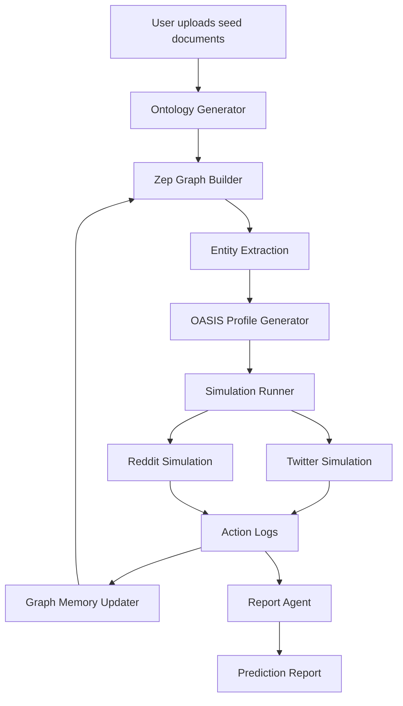

MiroFish is built as a full-stack swarm intelligence simulation platform that combines modern web technologies with AI-driven agent simulation.

## System Overview

MiroFish employs a three-tier architecture designed for scalability and modularity:

<CardGroup cols={3}>
  <Card title="Frontend Layer" icon="browser">
    Vue.js 3 with Vite for responsive user interface and real-time simulation monitoring
  </Card>
  <Card title="Backend Layer" icon="server">
    Flask REST API orchestrating graph construction, simulation execution, and report generation
  </Card>
  <Card title="External Services" icon="cloud">
    Zep Cloud for knowledge graphs and OASIS for multi-agent simulation
  </Card>
</CardGroup>

## Core Components

### Frontend Architecture

The frontend is built with **Vue.js 3** and **Vite**, providing a reactive single-page application:

```javascript
// Frontend stack from package.json
{
  "vue": "^3.4.21",
  "vite": "^5.2.0",
  "pinia": "^2.1.7",      // State management
  "vue-router": "^4.3.0"  // Routing
}
```

**Key frontend components:**
- **Step1GraphBuild.vue**: Graph construction interface with file upload and ontology generation
- **Step2EnvSetup.vue**: Environment configuration for agent profile generation
- **Step3Simulation.vue**: Real-time simulation monitoring with dual-platform progress tracking
- **Step4Report.vue**: Report generation interface with streaming agent logs
- **Step5Interaction.vue**: Interactive chat with agents and Report Agent

### Backend Architecture

The backend uses **Flask** with a service-oriented architecture:

```python
# From backend/app/__init__.py
from flask import Flask
from flask_cors import CORS

def create_app(config_class=Config):
    app = Flask(__name__)
    app.config.from_object(config_class)
    
    # Enable CORS for frontend communication
    CORS(app, resources={r"/api/*": {"origins": "*"}})
    
    # Register API blueprints
    from .api import graph_bp, simulation_bp, report_bp
    app.register_blueprint(graph_bp, url_prefix='/api/graph')
    app.register_blueprint(simulation_bp, url_prefix='/api/simulation')
    app.register_blueprint(report_bp, url_prefix='/api/report')
    
    return app
```

**Core backend services:**

<CardGroup cols={2}>
  <Card title="graph_builder.py" icon="project-diagram">
    Constructs knowledge graphs using Zep Cloud API with ontology-guided entity extraction
  </Card>
  <Card title="oasis_profile_generator.py" icon="user-circle">
    Generates detailed agent profiles from graph entities with personality and behavior traits
  </Card>
  <Card title="simulation_runner.py" icon="play">
    Manages OASIS simulation processes with real-time action logging and progress tracking
  </Card>
  <Card title="report_agent.py" icon="file-alt">
    LangChain-based ReACT agent for generating prediction reports with tool use
  </Card>
</CardGroup>

### Configuration Management

All configuration is centralized in a single class:

```python
# From backend/app/config.py
class Config:
    # LLM Configuration (OpenAI-compatible)
    LLM_API_KEY = os.environ.get('LLM_API_KEY')
    LLM_BASE_URL = os.environ.get('LLM_BASE_URL', 'https://api.openai.com/v1')
    LLM_MODEL_NAME = os.environ.get('LLM_MODEL_NAME', 'gpt-4o-mini')
    
    # Zep Cloud Configuration
    ZEP_API_KEY = os.environ.get('ZEP_API_KEY')
    
    # OASIS Simulation Configuration
    OASIS_DEFAULT_MAX_ROUNDS = int(os.environ.get('OASIS_DEFAULT_MAX_ROUNDS', '10'))
    OASIS_SIMULATION_DATA_DIR = '../uploads/simulations'
    
    # Platform action sets
    OASIS_TWITTER_ACTIONS = [
        'CREATE_POST', 'LIKE_POST', 'REPOST', 'FOLLOW', 
        'DO_NOTHING', 'QUOTE_POST'
    ]
    OASIS_REDDIT_ACTIONS = [
        'LIKE_POST', 'DISLIKE_POST', 'CREATE_POST', 'CREATE_COMMENT',
        'LIKE_COMMENT', 'DISLIKE_COMMENT', 'SEARCH_POSTS', 'SEARCH_USER',
        'TREND', 'REFRESH', 'DO_NOTHING', 'FOLLOW', 'MUTE'
    ]
```

## External Service Integration

### Zep Cloud for Knowledge Graphs

<Note>
  Zep Cloud provides GraphRAG capabilities for entity extraction, relationship mapping, and semantic search.
</Note>

MiroFish uses **Zep Cloud** as its knowledge graph backend:

```python
# From graph_builder.py
from zep_cloud.client import Zep
from zep_cloud import EpisodeData, EntityEdgeSourceTarget

class GraphBuilderService:
    def __init__(self, api_key):
        self.client = Zep(api_key=api_key)
    
    def create_graph(self, name: str) -> str:
        graph_id = f"mirofish_{uuid.uuid4().hex[:16]}"
        self.client.graph.create(
            graph_id=graph_id,
            name=name,
            description="MiroFish Social Simulation Graph"
        )
        return graph_id
    
    def set_ontology(self, graph_id: str, ontology: Dict[str, Any]):
        # Dynamically create entity and edge models from ontology
        entity_types = {}
        for entity_def in ontology.get("entity_types", []):
            # Create Pydantic model with Field descriptions
            entity_class = type(name, (EntityModel,), attrs)
            entity_types[name] = entity_class
        
        self.client.graph.set_ontology(
            graph_ids=[graph_id],
            entities=entity_types,
            edges=edge_definitions
        )
```

Key Zep operations:
- **Graph creation** with unique IDs
- **Ontology definition** with dynamic Pydantic models
- **Batch episode ingestion** with text chunking
- **Hybrid search** combining semantic and graph traversal

### OASIS for Multi-Agent Simulation

<Tip>
  OASIS (Open Agent Social Interaction Simulations) powers the social media simulation on Twitter and Reddit platforms.
</Tip>

The simulation runs OASIS in subprocess with action logging:

```python
# From simulation_runner.py
class SimulationRunner:
    @classmethod
    def start_simulation(
        cls,
        simulation_id: str,
        platform: str = "parallel",  # twitter / reddit / parallel
        max_rounds: int = None,
        enable_graph_memory_update: bool = False,
        graph_id: str = None
    ) -> SimulationRunState:
        # Select simulation script
        if platform == "twitter":
            script_name = "run_twitter_simulation.py"
        elif platform == "reddit":
            script_name = "run_reddit_simulation.py"
        else:
            script_name = "run_parallel_simulation.py"  # Both platforms
        
        # Launch subprocess
        process = subprocess.Popen(
            [sys.executable, script_path, "--config", config_path],
            cwd=sim_dir,
            stdout=main_log_file,
            stderr=subprocess.STDOUT,
            start_new_session=True  # New process group for clean termination
        )
        
        # Monitor action logs
        monitor_thread = threading.Thread(
            target=cls._monitor_simulation,
            args=(simulation_id,),
            daemon=True
        )
        monitor_thread.start()
```

**Dual-platform architecture:**
- Twitter and Reddit simulations run in **parallel processes**
- Each platform writes to separate `twitter/actions.jsonl` and `reddit/actions.jsonl` files
- Real-time monitoring parses JSONL logs for progress tracking

## Data Flow Architecture



<Steps>
  <Step title="Document Ingestion">
    User uploads seed materials (PDF, Markdown, TXT). Text is extracted and chunked for processing.
  </Step>
  
  <Step title="Ontology Generation">
    LLM analyzes content to generate domain-specific entity types (10 types) and relationship types (6-10 types) suitable for social media simulation.
  </Step>
  
  <Step title="Graph Construction">
    Zep Cloud processes text chunks to extract entities and relationships according to the ontology. Graph is built with nodes (entities) and edges (relationships).
  </Step>
  
  <Step title="Profile Generation">
    Each entity becomes an agent. LLM generates detailed profiles including personality (MBTI), demographics, social media behavior patterns, and topic interests.
  </Step>
  
  <Step title="Parallel Simulation">
    OASIS runs dual-platform simulation. Agents interact on Twitter and Reddit simultaneously. Actions logged to separate JSONL files.
  </Step>
  
  <Step title="Memory Updates">
    Agent activities are batched and sent back to Zep graph as new episodes, creating temporal evolution of relationships and facts.
  </Step>
  
  <Step title="Report Generation">
    ReACT-based Report Agent uses tools (insight_forge, panorama_search, interview_agents) to analyze simulation results and generate prediction report.
  </Step>
</Steps>

## Technology Stack

<CardGroup cols={2}>
  <Card title="Frontend" icon="code">
    - **Framework**: Vue.js 3.4.21
    - **Build Tool**: Vite 5.2.0
    - **State Management**: Pinia 2.1.7
    - **Routing**: Vue Router 4.3.0
    - **HTTP Client**: Axios 1.6.8
  </Card>
  
  <Card title="Backend" icon="python">
    - **Framework**: Flask 3.0.3
    - **Python Version**: 3.11-3.12
    - **Package Manager**: uv
    - **LLM Client**: OpenAI SDK (compatible)
    - **Graph API**: Zep Cloud SDK
  </Card>
  
  <Card title="AI Services" icon="brain">
    - **LLM**: Any OpenAI-compatible API (recommended: Qwen-Plus)
    - **Knowledge Graph**: Zep Cloud GraphRAG
    - **Agent Simulation**: OASIS framework
    - **Vector Search**: Zep hybrid search (RRF reranking)
  </Card>
  
  <Card title="DevOps" icon="docker">
    - **Containerization**: Docker & Docker Compose
    - **Process Management**: Python subprocess with threading
    - **Logging**: Python logging with file handlers
    - **File Storage**: Local filesystem with structured directories
  </Card>
</CardGroup>

## Deployment Architecture

MiroFish can be deployed via source code or Docker:

```bash
# Source deployment
npm run setup:all    # Install all dependencies
npm run dev          # Start frontend (port 3000) and backend (port 5001)

# Docker deployment  
docker compose up -d # Pull images and start containers
```

**Production considerations:**
- Backend runs on port **5001** with Flask development server
- Frontend runs on port **3000** with Vite dev server
- Simulation data stored in `backend/uploads/simulations/`
- Each simulation creates isolated directory with configs, logs, and databases

<Warning>
  MiroFish uses subprocess spawning for simulations. Ensure adequate CPU and memory resources. Each parallel simulation spawns 2+ processes (Twitter + Reddit).
</Warning>
