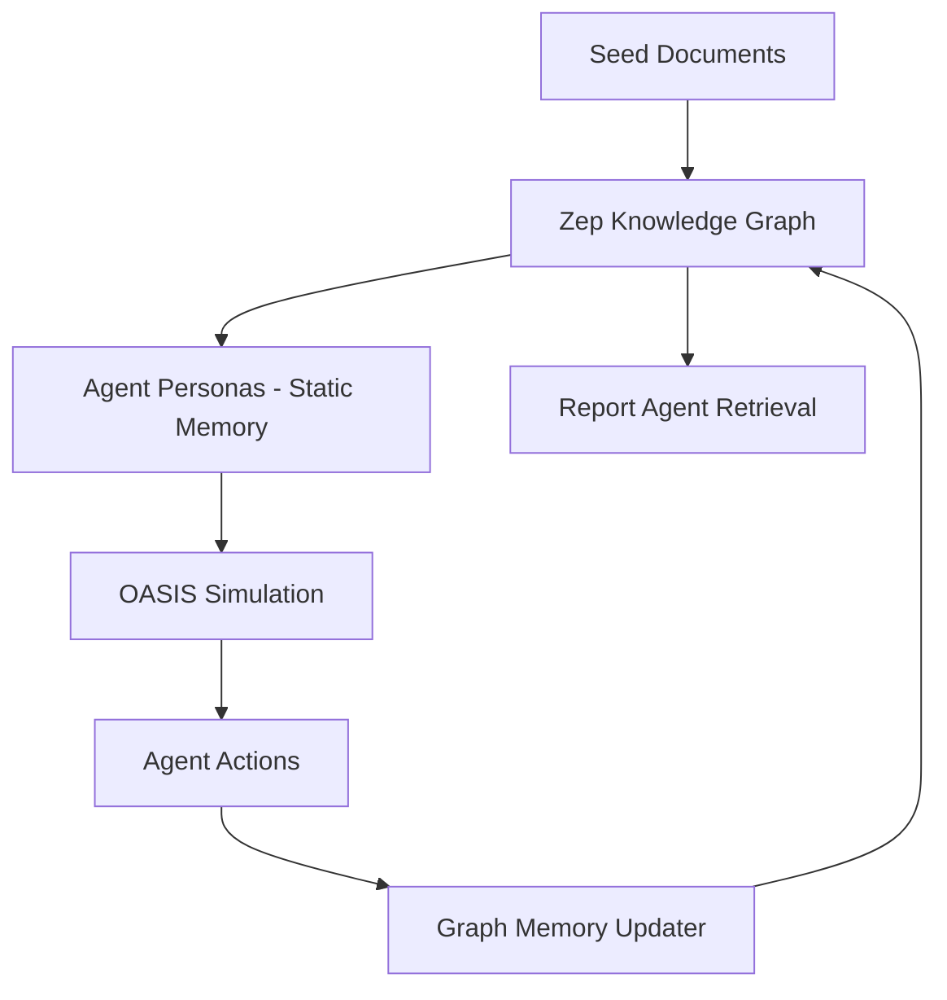

MiroFish implements a sophisticated memory system that combines static agent personas with dynamic, evolving knowledge graphs powered by Zep Cloud.

## Why Zep Cloud?

<CardGroup cols={2}>
  <Card title="GraphRAG Capabilities" icon="project-diagram">
    Zep provides built-in GraphRAG (Graph Retrieval-Augmented Generation) with automatic entity extraction and relationship mapping.
  </Card>
  
  <Card title="Hybrid Search" icon="search">
    Combines semantic vector search with graph traversal and RRF (Reciprocal Rank Fusion) reranking for optimal retrieval.
  </Card>
  
  <Card title="Temporal Knowledge" icon="clock">
    Facts are timestamped with `created_at`, `valid_at`, `invalid_at`, and `expired_at` for tracking evolution over time.
  </Card>
  
  <Card title="Cloud-Native" icon="cloud">
    Fully managed service with no infrastructure to maintain. Free tier sufficient for experimentation.
  </Card>
</CardGroup>

## Memory Architecture

MiroFish uses a **two-layer memory system**:



### Layer 1: Static Persona Memory

Each agent has a **static persona** (2000 words) that includes:

```python
# From oasis_profile_generator.py
persona_content = f"""
{agent.name} is a {agent.age}-year-old {agent.profession}...

Background and Relationship to Event:
- Their role in the scenario
- Past experiences relevant to the event
- Existing relationships with other entities

Personality and Behavior:
- MBTI type: {agent.mbti}
- Core traits and values
- Social media posting patterns
- Language style and catchphrases

Individual Memory:
- What they remember about the event
- Their past actions and reactions
- Their current stance and emotions
"""
```

This persona is **injected into OASIS** as the agent's system prompt and remains **constant during simulation**.

### Layer 2: Dynamic Graph Memory

The knowledge graph in Zep evolves through:

1. **Initial construction**: Entities and relationships from seed documents
2. **Runtime updates** (optional): Agent activities added as new episodes during simulation
3. **Temporal tracking**: All facts timestamped with creation and validity periods

## Memory Storage in Zep

### Graph Structure

A Zep graph consists of:

```python
# From graph_builder.py
class GraphInfo:
    graph_id: str              # "mirofish_a3f8b2c1"
    node_count: int            # Number of entities (50-200 typical)
    edge_count: int            # Number of relationships (100-500 typical)
    entity_types: List[str]    # Types extracted (Student, University, etc.)
```

**Nodes** represent entities:

```json
{
  "uuid": "ent_9a7f3e2b",
  "name": "Alice Chen",
  "labels": ["Entity", "Student"],
  "summary": "21-year-old Environmental Science student at Wuhan University, active in campus sustainability issues",
  "attributes": {
    "department": "Environmental Science",
    "year_level": "Junior"
  },
  "created_at": "2024-03-13T10:00:00Z"
}
```

**Edges** represent relationships:

```json
{
  "uuid": "edge_4b2c9d1a",
  "name": "STUDIES_AT",
  "fact": "Alice Chen studies at Wuhan University",
  "source_node_uuid": "ent_9a7f3e2b",
  "target_node_uuid": "ent_5f3a8c7d",
  "created_at": "2024-03-13T10:00:00Z",
  "valid_at": "2024-03-13T10:00:00Z",
  "invalid_at": null,
  "expired_at": null
}
```

### Episode-Based Updates

Memory updates use Zep's **episode** concept:

```python
# From graph_builder.py
from zep_cloud import EpisodeData

epis = EpisodeData(
    data="Alice Chen posted on Twitter: 'This is unacceptable! We demand answers!'",
    type="text"
)

self.client.graph.add(
    graph_id=graph_id,
    episodes=[epis]
)
```

Zep automatically:
- Extracts entities mentioned in the text
- Creates new nodes if entities don't exist
- Generates new edges based on content
- Timestamps all facts
- Links episodes to the facts they support

## Memory Updates During Simulation

<Tip>
  Enable graph memory updates to create temporal evolution of knowledge. This is optional but provides richer reports.
</Tip>

### Enabling Memory Updates

When starting simulation:

```python
# From simulation_runner.py
SimulationRunner.start_simulation(
    simulation_id=simulation_id,
    platform="parallel",
    enable_graph_memory_update=True,  # Enable dynamic updates
    graph_id=graph_id                 # Required when enabled
)
```

This creates a **ZepGraphMemoryUpdater** that:
1. Monitors agent action logs
2. Batches activities by platform
3. Sends batches to Zep as episodes

### Activity Batching

```python
# From zep_graph_memory_updater.py
class ZepGraphMemoryUpdater:
    BATCH_SIZE = 5  # Batch 5 activities per platform
    SEND_INTERVAL = 0.5  # Wait 0.5 seconds between sends
    
    def __init__(self, graph_id: str):
        self.graph_id = graph_id
        self.client = Zep(api_key=Config.ZEP_API_KEY)
        
        # Separate buffers for each platform
        self._platform_buffers = {
            'twitter': [],
            'reddit': [],
        }
    
    def add_activity(self, activity: AgentActivity):
        # Skip DO_NOTHING actions
        if activity.action_type == "DO_NOTHING":
            return
        
        # Add to appropriate platform buffer
        platform = activity.platform.lower()
        self._platform_buffers[platform].append(activity)
        
        # When buffer reaches BATCH_SIZE, send to Zep
        if len(self._platform_buffers[platform]) >= self.BATCH_SIZE:
            batch = self._platform_buffers[platform][:self.BATCH_SIZE]
            self._send_batch_activities(batch, platform)
            self._platform_buffers[platform] = self._platform_buffers[platform][self.BATCH_SIZE:]
```

### Activity-to-Episode Conversion

Each agent action is converted to natural language:

```python
# From zep_graph_memory_updater.py
class AgentActivity:
    def to_episode_text(self) -> str:
        # Different descriptions for different action types
        if self.action_type == "CREATE_POST":
            content = self.action_args.get("content", "")
            return f"{self.agent_name}: 发布了一条帖子:「{content}」"
        
        elif self.action_type == "LIKE_POST":
            post_content = self.action_args.get("post_content", "")
            post_author = self.action_args.get("post_author_name", "")
            return f"{self.agent_name}: 点赞了{post_author}的帖子:「{post_content}」"
        
        elif self.action_type == "QUOTE_POST":
            original_content = self.action_args.get("original_content", "")
            original_author = self.action_args.get("original_author_name", "")
            quote_content = self.action_args.get("quote_content", "")
            return f"{self.agent_name}: 引用了{original_author}的帖子「{original_content}」，并评论道:「{quote_content}」"
        
        # ... other action types
```

**Example batch sent to Zep:**

```
Alice Chen: 发布了一条帖子:「这太不可接受了!我们需要真相!」
Bob Zhang: 点赞了Alice Chen的帖子:「这太不可接受了!我们需要真相!」
Media Outlet: 转发了Alice Chen的帖子:「这太不可接受了!我们需要真相!」
University Official: 发布了一条帖子:「我们正在调查此事,请大家保持冷静。」
Carol Liu: 点赞了Bob Zhang对Alice Chen帖子的点赞
```

Zep processes this batch and:
- Reinforces existing entities (Alice, Bob, Media Outlet, etc.)
- Creates new POSTED, LIKED, RETWEETED relationships
- Extracts sentiment and topics from post content
- Links all facts to the original episodes for provenance

## Individual vs. Collective Memory

### Individual Memory (Agent Persona)

<Card title="Static, Personal" icon="user">
  Each agent's persona contains their personal memories and experiences. This is **generated once** during profile creation and **does not change** during simulation.
</Card>

From an agent's persona:

> "Alice Chen remembers the day she first noticed the strange smell in her dormitory. She had been one of the first to complain to the housing office, but her concerns were dismissed. This experience made her determined to speak out publicly when others began reporting similar issues. She feels a personal responsibility to advocate for her fellow students' health and safety."

This memory:
- **Guides behavior**: Alice is proactive and vocal
- **Shapes reactions**: She quickly posts about new developments
- **Influences stances**: Skeptical of official responses based on past dismissal
- **Remains constant**: This backstory doesn't change during the 72-hour simulation

### Collective Memory (Knowledge Graph)

<Card title="Dynamic, Shared" icon="users">
  The Zep graph stores the **collective understanding** of all entities, relationships, and events. This evolves continuously as new episodes are added.
</Card>

**Initial graph** (from seed documents):

```
[Alice Chen] -STUDIES_AT-> [Wuhan University]
[Alice Chen] -INTERESTED_IN-> [Environmental Issues]
[Formaldehyde Incident] -AFFECTS-> [Wuhan University Dormitories]
```

**After 24 hours of simulation:**

```
[Alice Chen] -STUDIES_AT-> [Wuhan University]
[Alice Chen] -INTERESTED_IN-> [Environmental Issues]
[Alice Chen] -POSTED_ABOUT-> [Formaldehyde Incident]  # NEW
[Alice Chen] -CRITICIZED-> [University Official]       # NEW
[Alice Chen] -FOLLOWED_BY-> [Media Outlet]             # NEW
[Bob Zhang] -AGREES_WITH-> [Alice Chen]                # NEW
[Media Outlet] -REPORTED_ON-> [Formaldehyde Incident]  # NEW
[University Official] -RESPONDED_TO-> [Alice Chen]     # NEW
```

This collective memory:
- **Tracks interactions**: Who talked to whom, who agreed/disagreed
- **Records timeline**: When each action occurred
- **Identifies clusters**: Sub-communities forming around shared opinions
- **Measures influence**: Which agents drive conversation
- **Enables retrieval**: Report Agent can query "Who supported Alice?" or "What did Media Outlet report?"

## Memory Retrieval for Report Generation

<Info>
  The Report Agent uses Zep's hybrid search to retrieve relevant memories when generating prediction reports.
</Info>

### Hybrid Search

Zep combines three retrieval methods:

```python
# From zep_tools.py
class ZepToolsService:
    def quick_search(self, graph_id: str, query: str, limit: int = 10):
        # Semantic + graph + RRF reranking
        result = self.client.graph.search(
            query=query,
            graph_id=graph_id,
            limit=limit,
            scope="edges",      # Search relationships/facts
            reranker="rrf"      # Reciprocal Rank Fusion
        )
        
        return [edge.fact for edge in result.edges]
```

**Three search dimensions:**

1. **Semantic search**: Vector similarity of query to fact text
2. **Graph traversal**: Walk relationships to find connected facts
3. **Temporal filtering**: Optionally filter by `valid_at` time range

**RRF reranking** merges results from all three methods:

```
RRF_score(doc) = Σ(1 / (k + rank_i))
```

Where `rank_i` is the document's rank in method `i`, and `k=60` (constant).

### Advanced Retrieval: InsightForge

For deep analysis, the Report Agent uses **InsightForge**:

```python
# From zep_tools.py
def insight_forge(
    self, 
    graph_id: str, 
    query: str, 
    simulation_requirement: str,
    report_context: str = ""
) -> InsightForgeResult:
    # Step 1: LLM decomposes query into 3-5 sub-questions
    sub_questions = self._generate_sub_questions(
        query, simulation_requirement, report_context
    )
    
    # Step 2: Search each sub-question in parallel
    all_facts = []
    for sub_q in sub_questions:
        facts = self.quick_search(graph_id, sub_q, limit=20)
        all_facts.extend(facts)
    
    # Step 3: Deduplicate and rank
    unique_facts = deduplicate_facts(all_facts)
    
    # Step 4: Extract entity insights
    entity_insights = self._extract_entity_insights(graph_id, unique_facts)
    
    # Step 5: Trace relationship chains
    relationship_chains = self._trace_relationships(graph_id, unique_facts)
    
    return InsightForgeResult(
        original_query=query,
        sub_questions=sub_questions,
        facts=unique_facts[:30],           # Top 30 facts
        entity_insights=entity_insights,   # Key entities and their roles
        relationship_chains=relationship_chains  # Multi-hop connections
    )
```

**Example InsightForge query:**

Query: "How did students react to the university's response?"

Sub-questions generated:
1. "What did students post after the university's statement?"
2. "What emotions did students express?"
3. "Did students organize any collective actions?"
4. "Which student leaders emerged?"

Facts retrieved:
- "Alice Chen posted: 'The university's response is inadequate...'"
- "Bob Zhang retweeted Alice's post with comment: 'We need to organize...'"
- "50 students signed online petition initiated by Alice Chen"
- "Student Union announced dormitory inspection demands"

Entity insights:
- **Alice Chen**: Opinion leader, high posting frequency, critical stance
- **Bob Zhang**: Organizer role, mobilizing peers
- **Student Union**: Official student voice, moderate stance

Relationship chains:
- Alice Chen → posted critique → University Official → issued statement → Media Outlet → reported on → Public awareness increased

### Temporal Memory Queries

Zep tracks when facts become valid and invalid:

```python
# From zep_tools.py
def panorama_search(
    self,
    graph_id: str,
    query: str,
    include_expired: bool = True
) -> PanoramaResult:
    # Get all edges (relationships)
    edges = fetch_all_edges(self.client, graph_id)
    
    # Separate current facts from historical facts
    current_facts = []
    expired_facts = []
    
    for edge in edges:
        if edge.invalid_at or edge.expired_at:
            expired_facts.append(edge)
        else:
            current_facts.append(edge)
    
    # Semantic ranking
    current_facts = self._rank_by_relevance(query, current_facts)
    expired_facts = self._rank_by_relevance(query, expired_facts)
    
    return PanoramaResult(
        query=query,
        current_facts=[e.fact for e in current_facts],
        expired_facts=[e.fact for e in expired_facts] if include_expired else [],
        total_current=len(current_facts),
        total_expired=len(expired_facts)
    )
```

**Use case: Tracking opinion evolution**

Current facts:
- "Alice Chen believes university is negligent" (valid_at: T0)
- "Bob Zhang supports Alice's stance" (valid_at: T1)
- "University Official promises investigation" (valid_at: T2)

Expired facts:
- "Alice Chen believed issue was minor" (valid_at: T-1, invalid_at: T0)
- "Bob Zhang was unaware of the issue" (valid_at: T-2, invalid_at: T1)

This allows Report Agent to write:

> "Initially, some students were unaware or unconcerned about the formaldehyde issue. However, after Alice Chen's vocal advocacy (T0), public opinion shifted dramatically. By T1, a coalition of students had formed, and by T2, the university was forced to respond with an investigation promise."

## Memory Performance and Scaling

<Warning>
  Memory updates are I/O intensive. For large simulations (1000+ agents, 100+ rounds), expect 10,000+ Zep API calls.
</Warning>

**Optimization strategies:**

1. **Batching**: Send 5 activities per API call instead of 1
2. **Platform separation**: Independent buffers for Twitter and Reddit avoid lock contention
3. **Action filtering**: Skip DO_NOTHING actions (no semantic content)
4. **Async processing**: Background thread handles Zep updates without blocking simulation
5. **Error recovery**: Failed batches logged but don't stop simulation

**Performance metrics:**

```python
def get_stats(self) -> Dict[str, Any]:
    return {
        "total_activities": 5000,      # Activities added to queue
        "batches_sent": 1000,          # Successful API calls (5 per batch)
        "items_sent": 5000,            # Activities successfully stored
        "failed_count": 5,             # Failed batches (retried 3x)
        "skipped_count": 2000,         # DO_NOTHING actions filtered
        "queue_size": 0,               # Current queue depth
        "buffer_sizes": {
            "twitter": 2,              # Pending Twitter activities
            "reddit": 3                # Pending Reddit activities
        }
    }
```

**Typical simulation:**
- **72 rounds** × **100 agents** × **0.5 actions/agent/round** = **3,600 activities**
- Filtered to ~2,000 meaningful actions (excluding DO_NOTHING)
- Sent in ~400 batches (5 per batch)
- Total Zep API calls: ~400
- Processing time: ~5-10 minutes (concurrent with simulation)

## Cost Considerations

<Info>
  Zep Cloud's free tier includes 250MB graph storage and 10,000 searches/month, sufficient for experimentation.
</Info>

**Free tier limits:**
- 250MB graph storage (~50,000 facts)
- 10,000 search queries/month
- 1,000 episode additions/month

**Typical usage:**
- **Graph construction**: 100-500 episodes (one-time)
- **Memory updates**: 400-800 episodes per simulation (optional)
- **Report generation**: 10-20 searches per report

For production use:
- **Pro tier** ($99/month): 10GB storage, 100K searches/month
- **Enterprise tier**: Custom limits and SLA

**Cost-saving tips:**
- Disable memory updates for short test runs
- Use smaller batch sizes to reduce failed retries
- Cache common queries in Report Agent
- Pre-generate profiles to avoid repeated entity reads
